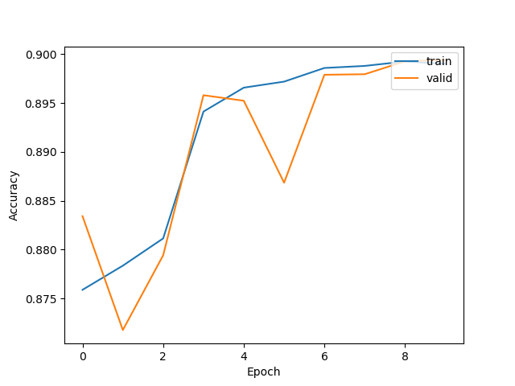
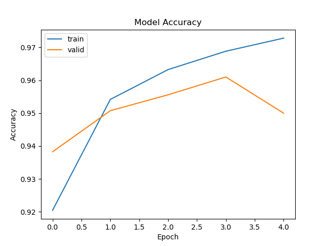

# Histopathologic-Cancer-Detection

In this kaggle competition modified PCam dataset is given. From that we have to detect whether a Whole-slide images
is having benign or malignant tumour cells in its center 32 x 32 pixel.

## DATASET

* Train data  - 220,025
* Test  data  - 57,458

### NOTE

In the given "Histopathology.py" file the commented lines are the various trials we made before using DenseNet121 Architecture

## Trail 1 : (Using Seperable Convolution)

* Training   Accuracy - 71 %
* Validation Accuracy - 77 %

## Trail 2 : (Using Convolution)

Below graph is for 26-30 epochs

* Training   Accuracy - 89.99%
* Validation Accuracy - 89.92 %

## Trail 3 : (DenseNet121)

## System

8 CPU, 16GB RAM, Paperspace GPU
